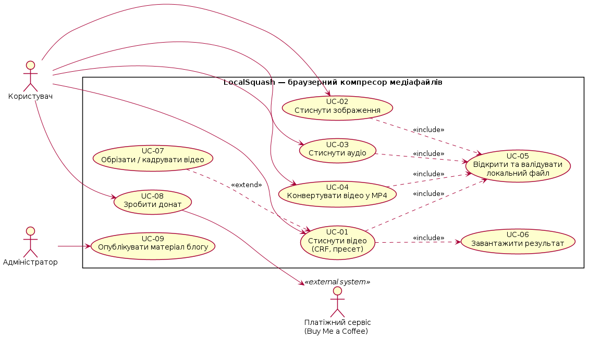
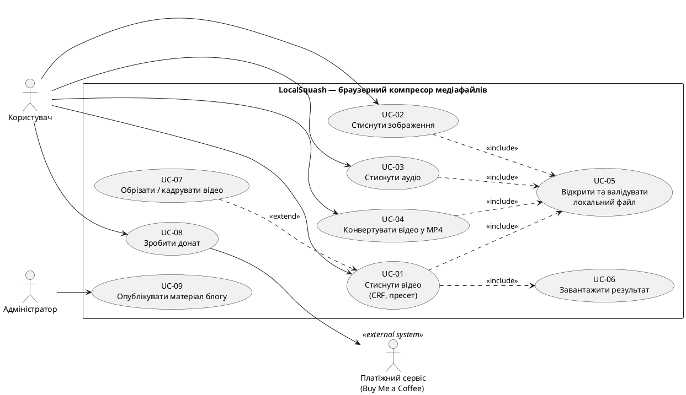
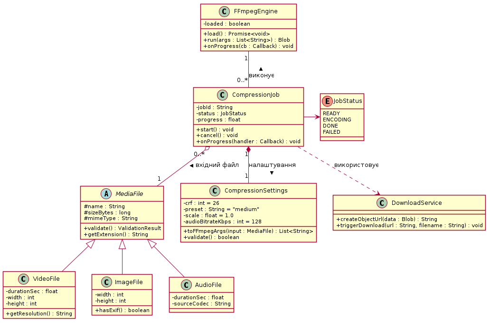
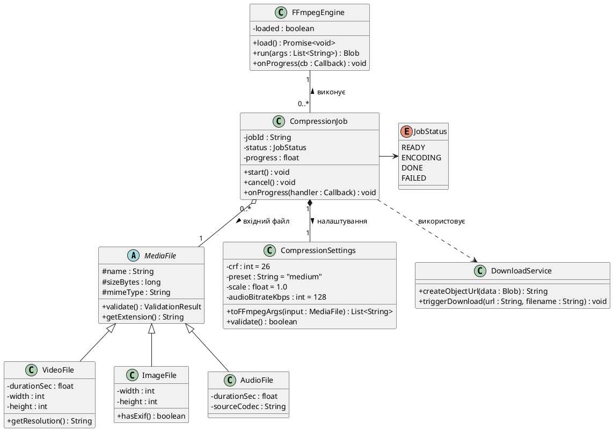
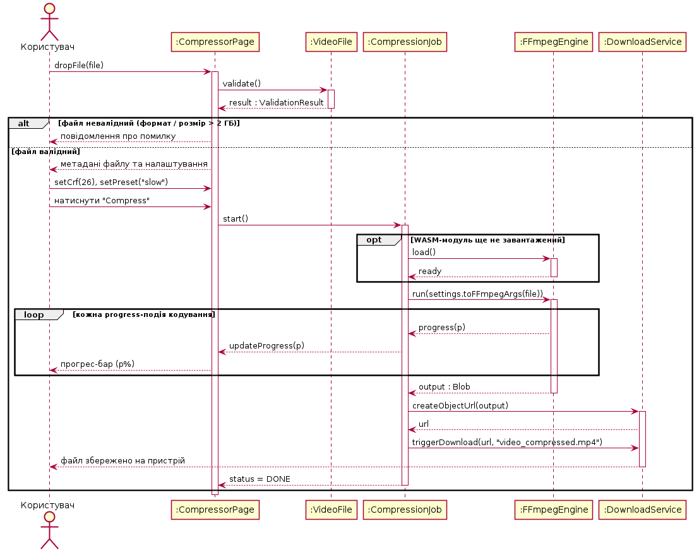
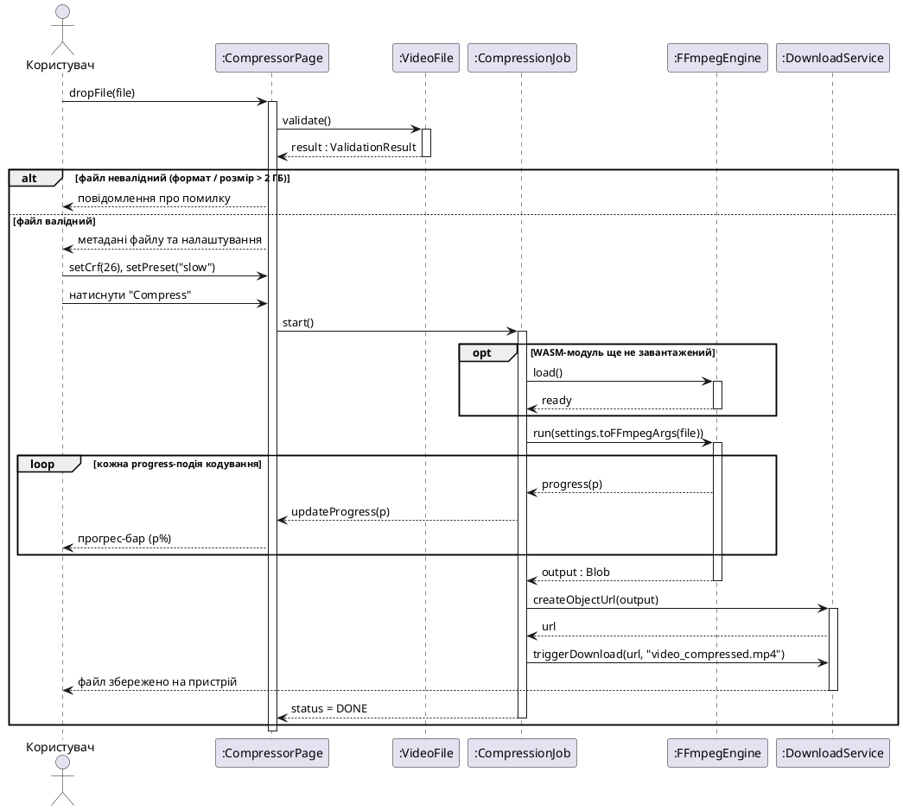

# ЛР 02 — Моделювання системи LocalSquash засобами UML

**Студент:** Герасименко Анатолій Вячеславович, група ПЗПІ 25-2 (індивідуальне виконання)
**Проєкт:** LocalSquash — браузерний сервіс локального стиснення та конвертації медіафайлів (ПЗ 01–02)
**Інструмент:** PlantUML (code-as-diagram); джерела діаграм — у цьому документі та в цій теці поруч із зображеннями

---

## 1. Функціональні вимоги

Сім вимог відібрано з SRS, розробленого на ПЗ 01 (ідентифікатори збережено для наскрізної трасовності).

| ID | Функціональна вимога | Пріоритет |
|---|---|---|
| FR-01 | Система має дозволяти відкрити локальний медіафайл через drag&drop або діалог вибору без передачі його на сервер | Високий |
| FR-02 | Система має виконувати стиснення відео у H.264/MP4 з налаштовуваним CRF у діапазоні 0–51 | Високий |
| FR-03 | Система має надавати вибір швидкісного пресета кодування (ultrafast–veryslow) | Високий |
| FR-07 | Система має стискати зображення з вибором формату (WebP/JPEG/PNG) та якості 1–100 | Високий |
| FR-08 | Система має стискати аудіо з вибором кодека (AAC/MP3/Opus) та бітрейту 32–320 kbps | Високий |
| FR-09 | Система має конвертувати вхідні відеоформати (MOV/MKV/WebM та ін.) у сумісний MP4 | Високий |
| FR-10 | Система має відображати прогрес кодування та автоматично завантажувати результат | Середній |

Кожна вимога однозначна (одна дія системи), перевірювана (критерії перевірки визначені в матриці відстежуваності SRS) і трасована (див. розділ 5).

## 2. Діаграма прецедентів (Use Case Diagram)

Актори: **Користувач** (анонімний — система працює без реєстрації), **Адміністратор** (публікація матеріалів блогу), **Платіжний сервіс Buy Me a Coffee** (зовнішня система, що обробляє донати). Дев'ять прецедентів у межах системи; зв'язки include (валідація файлу обов'язкова для всіх сценаріїв стиснення) та extend (обрізання/кадрування — необов'язкове розширення стиснення відео).

Джерело PlantUML

## 3. Діаграма класів (Class Diagram)

Дев'ять елементів моделі: абстрактний `MediaFile` з трьома нащадками (наслідування), `CompressionJob` як центральний клас сценарію — **композиція** з `CompressionSettings` (налаштування не існують поза задачею), **агрегація** `MediaFile` (файл існує незалежно від задачі), асоціація з `FFmpegEngine` з кратностями, залежність від `DownloadService`, перелік `JobStatus`.

Джерело PlantUML

## 4. Діаграма послідовності (Sequence Diagram)

SD-01 — ключовий сценарій **«Стиснути відео» (UC-01, вимоги FR-01, FR-02, FR-10)**. Містить лінії життя, смуги активації, синхронні та зворотні повідомлення, комбіновані фрагменти: `alt` (валідний/невалідний файл), `opt` (ледаче завантаження WASM-модуля), `loop` (progress-події кодування).

Джерело PlantUML

## 5. Матриця трасовності

| Вимога | Use Case | Класи | Sequence |
|---|---|---|---|
| FR-01 | UC-05 | MediaFile, VideoFile, ImageFile, AudioFile | SD-01 (фрагмент валідації) |
| FR-02 | UC-01 | CompressionJob, CompressionSettings, FFmpegEngine, VideoFile | SD-01 |
| FR-03 | UC-01 | CompressionSettings | SD-01 (параметри run) |
| FR-07 | UC-02 | ImageFile, CompressionJob, CompressionSettings | — |
| FR-08 | UC-03 | AudioFile, CompressionJob, CompressionSettings | — |
| FR-09 | UC-04 | FFmpegEngine, CompressionSettings | — |
| FR-10 | UC-01, UC-06 | CompressionJob, FFmpegEngine, DownloadService | SD-01 (loop прогресу та завантаження) |

Прогалин у покритті немає: кожна вимога відображена щонайменше одним прецедентом і одним класом; ключовий сценарій FR-02 деталізовано діаграмою послідовності SD-01.
