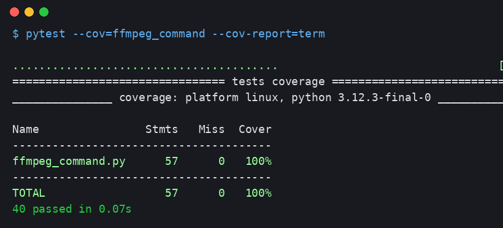

# ЛР 04 — Рефакторинг та Code Review

**Студент:** Герасименко Анатолій Вячеславович, група ПЗПІ 25-2 (індивідуальне виконання: автор і рецензент в одній особі, review проведено через окрему гілку та Pull Request)
**Проєкт:** LocalSquash; модуль `lr03/ffmpeg_command.py` з ЛР 03

## 1. Тема та мета

**Тема:** покращення якості програмного коду через систематичний Code Review та рефакторинг із контролем регресії.

**Мета:** набуття навичок виявлення code smells, документування зауважень у Pull Request, виконання рефакторинг-операцій зі збереженням поведінки (зелені тести ЛР 03) та вимірювання ефекту через метрики статичного аналізу (Ruff) і цикломатичної складності (radon).

## 2. Результати Code Review

Інструменти: Ruff 0.14 (правила E, W, F, C90, N, B, SIM, PLR), radon 6.0. Початковий стан: **Ruff — 10 issues; radon — 2 функції з оцінкою B** (`format_file_size` CC=8, `crf_quality_label` CC=6), Maintainability Index 66.16.

| № | Рядок коду | Проблема | Категорія | Рекомендація |
|---|---|---|---|---|
| 1 | 39–49 | Межі зон CRF (17, 22, 26, 35, 51) зашиті в if-ланцюжок; Ruff: 5×PLR2004 | Magic Numbers | Винести межі в іменовані константи; ланцюжок замінити табличним пошуком |
| 2 | 71–74 | Перевірка діапазону повторюється для `scale` і `audio_bitrate_kbps` тим самим патерном `if not lo <= x <= hi: raise` | Duplicated Code | Витягти хелпер `_check_range(value, low, high, message)` |
| 3 | 104 | `raise AssertionError("unreachable")` після циклу — недосяжний за побудовою (зафіксовано у висновках ЛР 03 як 2% непокритого коду) | Dead Code | Перебудувати цикл так, щоб остання одиниця оброблялась як вихід за замовчуванням |
| 4 | 57–62 | `build_ffmpeg_args` приймає 5 позиційних параметрів | Long Parameter List | Перейти на об'єкт налаштувань `CompressionSettings` (передбачений UML-моделлю ЛР 02); зафіксовано як технічний борг — зміна публічного API виходить за межі цієї роботи |
| 5 | 22–34 | `validate_input_file` повертає `tuple(bool, str)` — стиль кодів помилок | Primitive Obsession | У перспективі — тип `ValidationResult` або виняток; борг, бо змінює контракт, на який зав'язані тести ЛР 03 |
| 6 | 80 | Рядок 90 символів (Ruff E501, ліміт 88) | Formatting | Розбити конкатенацію списку аргументів на два вирази |

Зауваження 1, 2, 3, 6 виправлені рефакторингом (розділ 4); зауваження 4 і 5 свідомо залишені як задокументований технічний борг, оскільки змінюють публічний API модуля.

## 3. Посилання на Pull Request

https://github.com/anatoliiherasymenko-oss/localsquash-srs/pull/1 — гілка `review-anatolii` → `main`; шість зауважень із таблиці розділу 2 продубльовано як inline-коментарі до відповідних рядків у вкладці Files changed.

## 4. Результати рефакторингу (БУЛО → СТАЛО → ЧОМУ)

### Операція R1. Табличний пошук зон CRF замість if-ланцюжка (зауваження №1)

**БУЛО:**

```python
if not 0 <= crf <= 51:
    raise ValueError("CRF має бути в діапазоні 0–51")
if crf <= 17:
    return "lossless / archival"
if crf <= 22:
    return "near-lossless"
if crf <= 26:
    return "balanced (recommended)"
if crf <= 35:
    return "maximum compression"
return "preview only"
```

**СТАЛО:**

```python
CRF_MIN, CRF_MAX = 0, 51
_CRF_ZONES = (
    (17, "lossless / archival"),
    (22, "near-lossless"),
    (26, "balanced (recommended)"),
    (35, "maximum compression"),
    (CRF_MAX, "preview only"),
)

def crf_quality_label(crf: int) -> str:
    _check_range(crf, CRF_MIN, CRF_MAX, f"CRF має бути в діапазоні {CRF_MIN}–{CRF_MAX}")
    for upper_bound, label in _CRF_ZONES[:-1]:
        if crf <= upper_bound:
            return label
    return _CRF_ZONES[-1][1]
```

**ЧОМУ:** межі зон стали даними, а не керівною логікою: додавання чи зміна зони — це правка одного рядка таблиці без зміни алгоритму. Цикломатична складність функції впала з 6 (оцінка B) до 3 (оцінка A); зникли 5 попереджень PLR2004.

### Операція R2. Хелпер `_check_range` та іменовані межі параметрів (зауваження №2, №6)

**БУЛО:**

```python
if not 0.1 <= scale <= 1.0:
    raise ValueError("Масштаб має бути в діапазоні 0.1–1.0")
if not 32 <= audio_bitrate_kbps <= 320:
    raise ValueError("Бітрейт аудіо має бути в діапазоні 32–320 kbps")
```

**СТАЛО:**

```python
SCALE_MIN, SCALE_MAX = 0.1, 1.0
AUDIO_BITRATE_MIN, AUDIO_BITRATE_MAX = 32, 320

def _check_range(value: float, low: float, high: float, message: str) -> None:
    if not low <= value <= high:
        raise ValueError(message)

_check_range(scale, SCALE_MIN, SCALE_MAX,
             f"Масштаб має бути в діапазоні {SCALE_MIN}–{SCALE_MAX}")
_check_range(audio_bitrate_kbps, AUDIO_BITRATE_MIN, AUDIO_BITRATE_MAX,
             f"Бітрейт аудіо: {AUDIO_BITRATE_MIN}–{AUDIO_BITRATE_MAX} kbps")
```

**ЧОМУ:** усунуто дублювання патерна перевірки (DRY): валідація діапазону тепер визначена в одному місці, повідомлення будуються з тих самих констант, що й перевірка, тому межа в тексті помилки не може розійтися з межею в коді. Складність `build_ffmpeg_args` впала з 5 до 3; виправлено E501.

### Операція R3. Усунення мертвого коду у `format_file_size` (зауваження №3)

**БУЛО:**

```python
units = ["B", "KB", "MB", "GB", "TB"]
value = float(size_bytes)
for unit in units:
    if value < 1024 or unit == units[-1]:
        if unit == "B":
            return f"{int(value)} {unit}"
        return f"{value:.1f} {unit}"
    value /= 1024
raise AssertionError("unreachable")
```

**СТАЛО:**

```python
BYTES_PER_UNIT = 1024
_SIZE_UNITS = ("B", "KB", "MB", "GB", "TB")

def _format_with_unit(value: float, unit: str) -> str:
    if unit == _SIZE_UNITS[0]:
        return f"{int(value)} {unit}"
    return f"{value:.1f} {unit}"

value = float(size_bytes)
for unit in _SIZE_UNITS[:-1]:
    if value < BYTES_PER_UNIT:
        return _format_with_unit(value, unit)
    value /= BYTES_PER_UNIT
return _format_with_unit(value, _SIZE_UNITS[-1])
```

**ЧОМУ:** остання одиниця (TB) стала виходом за замовчуванням після циклу, тож захисний недосяжний `raise` більше не потрібен — мертвий код зник, а разом із ним і складена умова `value < 1024 or unit == units[-1]` з прихованою перевіркою останнього елемента. Складність впала з 8 до 6; line coverage модуля зріс із 98 % до 100 % — тести тепер проходять кожен рядок.

## 5. Регресійне тестування

Після кожної операції запускався повний набір тестів ЛР 03 (40 тестів). Фінальний прогін:



**40 passed, line coverage 100 %.** Публічний API модуля не змінювався, жоден тест не редагувався — поведінка збережена.

## 6. Порівняння метрик «ДО / ПІСЛЯ»

| Метрика | ДО | ПІСЛЯ | Зміна |
|---|---|---|---|
| Ruff issues (E,W,F,C90,N,B,SIM,PLR) | 10 | 0 | −10 |
| SonarLint issues (VS Code) | див. скріншот «до» | див. скріншот «після» | — |
| CC `crf_quality_label` | 6 (B) | 3 (A) | −3 |
| CC `build_ffmpeg_args` | 5 (A) | 3 (A) | −2 |
| CC `format_file_size` | 8 (B) | 6 (B) | −2 |
| Середня CC модуля (radon) | 5.0 | 3.1 | −1.9 |
| Maintainability Index | 66.16 (A) | 66.65 (A) | +0.49 |
| Line coverage | 98 % | 100 % | +2 п.п. |

Функцій з оцінкою B стало менше (2 → 1); найскладніша функція тепер `format_file_size` з CC=6 — її подальше спрощення (виділення перевірок типу в окремий валідатор) — кандидат на наступну ітерацію.

## 7. Підсумкова рефлексія

Найцінніше у цій роботі — побачити, що review і метрики ловлять різні класи проблем: Ruff механічно знайшов усі магічні числа, але «довгий список параметрів» і «кортеж замість типу результату» видно лише людським оком, бо це питання дизайну, а не синтаксису. Друге спостереження: рефакторинг без тестів з ЛР 03 був би азартною грою — саме зелений прогін після кожного кроку дозволив переписати три функції без страху зламати контракт. І третє: не кожне зауваження треба виправляти негайно — два пункти review свідомо лишилися технічним боргом, бо ціна зміни публічного API зараз вища за виграш, і чесна фіксація цього в звіті теж є інженерним рішенням.
